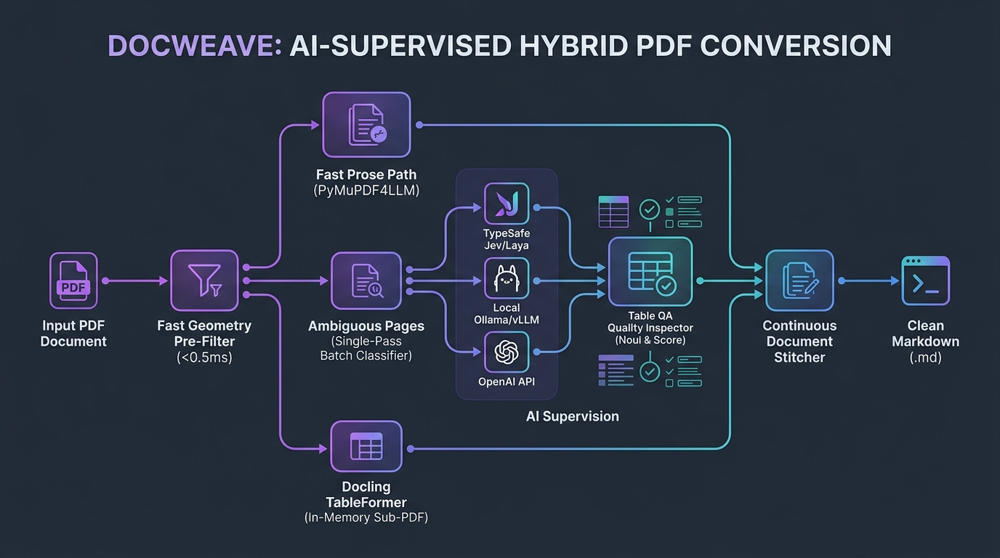
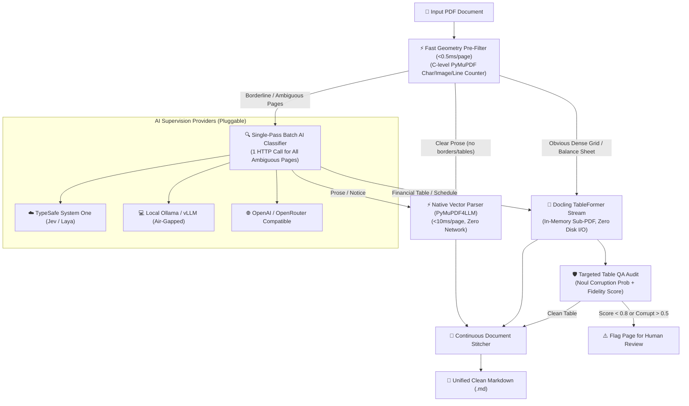

# docweave: AI-Supervised PDF-to-Markdown Engine

[](https://www.python.org/downloads/)
[](https://typesafe.ai)
[](https://ollama.ai)
[](https://opensource.org/licenses/MIT)

**AI-Supervised PDF-to-Markdown with TypeSafe (Jev / Laya) System One and Local LLM (Ollama, vLLM, LM Studio) semantic routing and financial table QA auditing.**

While standard pipelines rely solely on local geometry heuristics, `docweave` adds an intelligent AI supervision layer designed specifically for complex financial filings (SEBI/SEC notices, annual reports, debt circulars):

1. **Batched Ambiguity Routing**: High-confidence pages (pure prose or dense balance sheets) take the instant local fast-path ($<0.5\,\text{ms}$). Borderline pages (decorative letterheads, border boxes, schedules) are resolved collectively in **one single batched request** using TypeSafe (Jev/Laya) or any local OpenAI-compatible model (Ollama, vLLM, LM Studio).
2. **In-Flight Financial Table QA Audit**: Converted financial tables are audited in-flight with Jev Noul (corruption probability) & Score (structural fidelity), immediately flagging mangled columns or lost decimal alignments for human escalation.

---

## 🏛️ Architecture

<p align="center">
  
</p>



---

## ⚙️ Configuration & Model Providers

`docweave` supports multiple providers configured via `config.json` (copy from `config.template.json`) or environment variables. It works seamlessly with **cloud APIs** as well as **100% offline local models**:

### 1. Copy Config Template
```bash
cp config.template.json config.json
```

### 2. Available Providers in `config.json`:

```json
{
  "active_provider": "typesafe",
  "providers": {
    "typesafe": {
      "name": "TypeSafe System One (Jev / Laya)",
      "endpoint": "https://api.typesafe.ai/v1/systemone",
      "api_key": "your-typesafe-key",
      "model": "jev-latest",
      "timeout": 12.0
    },
    "local_ollama": {
      "name": "Local Ollama (Air-Gapped / Privacy)",
      "endpoint": "http://localhost:11434/v1/chat/completions",
      "api_key": "ollama",
      "model": "llama3.2:latest",
      "timeout": 30.0
    },
    "local_vllm": {
      "name": "Local vLLM / LM Studio",
      "endpoint": "http://localhost:8000/v1/chat/completions",
      "api_key": "not-needed",
      "model": "meta-llama/Llama-3.2-3B-Instruct",
      "timeout": 30.0
    },
    "openai": {
      "name": "OpenAI / OpenRouter",
      "endpoint": "https://api.openai.com/v1/chat/completions",
      "api_key": "your-openai-key",
      "model": "gpt-4o-mini",
      "timeout": 15.0
    }
  }
}
```

### 3. Quick Switch via Environment Variables
```bash
# Use TypeSafe (Jev / Laya)
export DOCWEAVE_PROVIDER="typesafe"
export TYPESAFE_API_KEY="your-api-key"

# Use Local Ollama (Completely Free & Offline)
export DOCWEAVE_PROVIDER="local_ollama"

# Use Local vLLM / LM Studio
export DOCWEAVE_PROVIDER="local_vllm"
```

---

## 🚀 Installation & Usage

### Installation
```bash
pip install -e .
```

### CLI
```bash
# Convert with active AI supervision and table auditing
docweave input.pdf -o output.md

# Convert with table auditing disabled
docweave input.pdf --no-qa -o output.md

# Custom hardware acceleration
docweave input.pdf --threads 10 --batch-size 16
```

### Python API
```python
from pathlib import Path
import docweave

result = docweave.convert(
    pdf_path=Path("input/annual_report.pdf"),
    output_path=Path("output/annual_report.md"),
    audit_quality=True
)

print(f"Total Pages: {result['total_pages']}")
print(f"Ambiguous Pages Routed by AI: {result['ambiguous_routed_by_jev']}")
print(f"Tables Audited: {result['table_qa_audited']}")
```

---

## 📜 License
MIT License.
